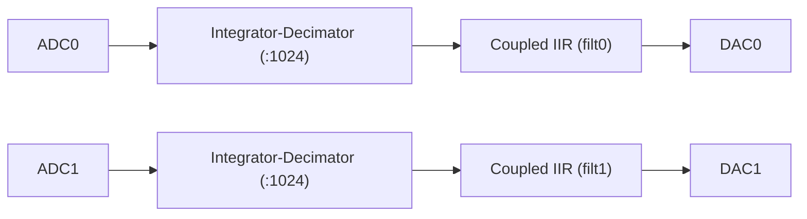
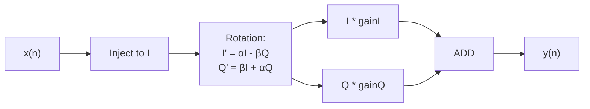

# Second order IIR filter (coupled form), 2 channels

**Bitfile:** `bitfiles/iir2nd_coupled_2ch.bit`  
**Description:** Two independent 2nd-order IIR filters implemented in *coupled resonator form* (quadrature state representation).  
**Build date:** 2025-01-14

This bitfile implements a **pair of resonant IIR filters** using the *coupled-form (quadrature)* structure.  
Instead of the usual direct-form coefficients \(b_0,b_1,b_2,a_1,a_2\), the filter uses:

- **α** (alpha): real part of the complex pole  
- **β** (beta): imaginary part of the complex pole  
- **gainI**, **gainQ**: output scaling for the in-phase and quadrature components  

### Resonator interpretation

The internal state update is:

$$
\begin{pmatrix}
I[n] \\ Q[n]
\end{pmatrix}
=
\begin{pmatrix}
\alpha & -\beta \\
\beta & \alpha
\end{pmatrix}
\begin{pmatrix}
I[n-1] \\ Q[n-1]
\end{pmatrix}
+
\begin{pmatrix}
x[n] \\ 0
\end{pmatrix}
$$

and the scalar output is:

$$
y[n] = \text{gainI}\cdot I[n] + \text{gainQ}\cdot Q[n]
$$

Pole radius:

$$
r=\sqrt{\alpha^2+\beta^2}, \qquad
\omega_0 = \tan^{-1}\!\left(\frac{\beta}{\alpha}\right)
$$

Coefficient format: **Q19**  
Gain format: **Q10**

---

## 1. Module overview

There are two filters:

- **`filt0`** – coupled IIR on channel 0  
- **`filt1`** – coupled IIR on channel 1  

Each channel has an independent α, β, gainI, gainQ, and reset.

Update period: `8.192e-6 s` (≈122.07 kHz).  

Shared module settings:

- `LOG_DIV = 10`  
- `LOG_A0 = 19`  
- `LOG_UNITY_GAIN = 10`  
- `DATA_WIDTH = 20`  
- `COEFF_WIDTH = 20`  
- `GAIN_WIDTH = 18`  

---

## 2. Signal chain



Internal conceptual structure:




---

## 3. Register map

### 3.1 `filt0` — base `0x40001000`

| Name  | Offset | Signed | log_scale | Description |
|-------|--------|--------|-----------|-------------|
| alpha | 0x00 | yes | 19 | resonance coefficient α |
| beta  | 0x04 | yes | 19 | resonance coefficient β |
| gainI | 0x08 | no  | 10 | in-phase output gain |
| gainQ | 0x0C | no  | 10 | quadrature output gain |
| reset | 0x10 | no  | 0  | clear internal state |

### 3.2 `filt1` — base `0x40002000`

Identical fields, different base.

| Name  | Offset | Signed | log_scale | Description |
|-------|--------|--------|-----------|-------------|
| alpha | 0x00 | yes | 19 | resonance coefficient α |
| beta  | 0x04 | yes | 19 | resonance coefficient β |
| gainI | 0x08 | no  | 10 | in-phase output gain |
| gainQ | 0x0C | no  | 10 | quadrature output gain |
| reset | 0x10 | no  | 0  | clear internal state |

---

## 4. Typical Python usage

```python
from python_rp.redpitaya_dev import redpitaya_dev
from python_rp.compute_coeff import coupled_oscillator

dev = redpitaya_dev("rp", "config/iir2nd_coupled_2ch.json")

Ts = 8.192e-6

# Channel 0: 1 kHz resonator, Q=50
c0 = coupled_oscillator(frequency=1000, Q=50, Ts=Ts,
                        gainI=1.0, gainQ=0.0)

# Channel 1: 2 kHz resonator, Q=80
c1 = coupled_oscillator(frequency=2000, Q=80, Ts=Ts,
                        gainI=1.0, gainQ=0.0)

dev.set_all_registers("filt0", c0, reset=True)
dev.set_all_registers("filt1", c1, reset=True)
```

Quadrature-response example:

```python
c = coupled_oscillator(1500, Q=100, Ts=Ts, gainI=0.0, gainQ=1.0)
dev.set_all_registers("filt0", c, reset=True)
```

---

## 5. Notes

- Stability requires $\alpha^2 + \beta^2 < 1$
- `alpha`, `beta` close to unity correspond to high-Q filters.  
- Coupled form is numerically more stable than direct form for high-Q resonators.  
- Gains are scaled by $2^{10}$.  
- Always reset after updating coefficients.

