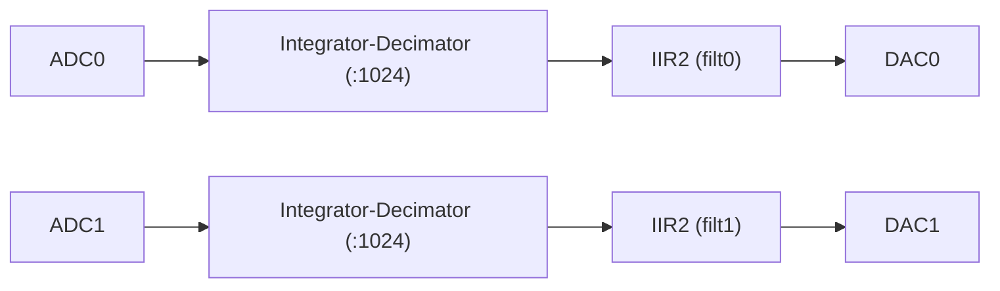

# Second order IIR filter, 2 channels

**Bitfile:** `bitfiles/iir2nd_direct_axi_2ch.bit`  
**Description:** Two independent 2nd-order IIR filters (direct form).  
**Build date:** 2025-01-14

This bitfile implements a **pair of 2nd-order IIR filters in direct form** on the Red Pitaya.
The transfer function is:
$$
	H(z) = \frac{b_0 + b_1z^{-1} + b_2z^{-2}}{1 + a_1z^{-1} + a_2z^{-2}}
$$
with $z = e^{j\omega}$. This is implemented in verilog, via the difference equation:
$$
y[n] = b_0 x[n] + b_1x[n-1] + b_2x[n-2]- a_1y[n-1] - a_2y[n-2]
$$


---

## 1. Module overview

There are two filters:
-  **`filt0`** – 2nd-order IIR (direct form) on channel 0  
- **`filt1`** – 2nd-order IIR (direct form) on channel 1  

Each channel has its own coefficient set and gain.  
Update period: `8.192e-6 s` (≈122.07 kHz).  
Coefficient format: **Q30**.  
Gain format: **Q9**.


Both modules share:

- `LOG_DIV = 10`  
- `LOG_A0 = 30`  
- `LOG_UNITY_GAIN = 9`  
- `DATA_WIDTH = 32`  
- `COEFF_WIDTH = 32`  
- `GAIN_WIDTH = 18`  

---

## 2. Signal chain



---

## 3. Register map

### 3.1 `filt0` — base `0x40000000`

| Name  | Offset | Signed | log_scale | Description |
|------|--------|--------|-----------|-------------|
| b0 | 0x00 | yes | 30 | numerator |
| b1 | 0x04 | yes | 30 | numerator |
| b2 | 0x08 | yes | 30 | numerator |
| a1 | 0x0C | yes | 30 | denominator |
| a2 | 0x10 | yes | 30 | denominator |
| gain | 0x14 | no | 9 | output gain |
| reset | 0x18 | no | 0 | reset |

### 3.2 `filt1` — base `0x40001000`

Same register structure, different base.

---

## 4. Typical Python usage

```python
from neutrality_control.redpitaya.redpitaya_dev import redpitaya_dev
from neutrality_control.redpitaya.compute_coeff import lowpass

dev = redpitaya_dev("rp", "config/iir2nd_direct_axi_2ch.json")

Ts = 8.192e-6

c0 = lowpass(1e3, Ts=Ts)   # low-pass on channel 0
c1 = lowpass(5e3, Ts=Ts)   # low-pass on channel 1

dev.set_all_registers("filt0", c0, reset=True)
dev.set_all_registers("filt1", c1, reset=True)
```

---

## 5. Notes

- Reset filter after coefficient updates.  
- Keep gains reasonable to avoid overflow.  
- Coefficients are `value / 2^30`.  
- Gain is `value / 2^9`.

