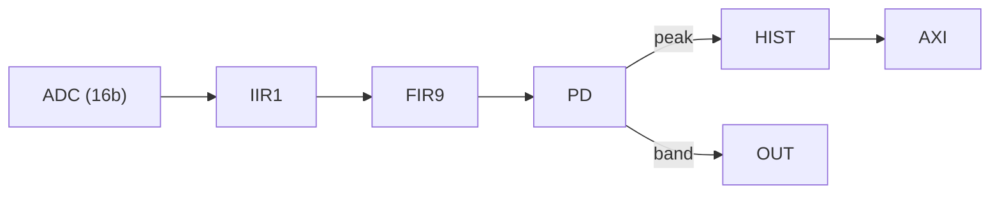

# Multi-Channel Analyzer

**Bitfile:** `bitfiles/mca_simple.bit`  
**Description:** Complete nuclear spectroscopy chain: IIR1 → FIR9 → Peak Detector → Histogram.  
**Build date:** 2025-10-21

This bitfile implements a full MCA chain on the Red Pitaya:

1. **`iir1`** – first-order IIR (typically high-pass / baseline restoration)  
2. **`fir9`** – 9-tap FIR shaping filter  
3. **`peak_detector`** – pulse detection + peak height and integrals  
4. **`histogram`** – online peak-height histogrammer (MCA)

All modules share the same fundamental timebase:

- Red Pitaya base clock: `timebase_rp = 8e-9 s` (125 MHz)
- Module update period: `timebase_module = 16e-9 s` (62.5 MHz)

---

## 1. Module overview

### 1.1 `iir1` (first-order IIR)

- Type: `iir1st_minimal`
- Purpose: simple first-order IIR (e.g. high-pass or low-pass), used here mostly for baseline conditioning.
- Fixed-point format:
  - Coefficients: Q24 (`LOG_A0 = 23`, `log_scale = 24` in registers)
  - Data path width: 18 bits (internal), 16-bit in/out

**Relevant settings**

- `LOG_DIV = 1` – internal divider (not always used in this minimal version)  
- `LOG_A0 = 23` – internal accumulator scaling  
- `IN_DATA_WIDTH = OUT_DATA_WIDTH = 16`  
- `DATA_WIDTH = 18`, `COEFF_WIDTH = 25`

### 1.2 `fir9` (9-tap FIR shaping filter)

- Type: `fir9_minimal`
- Purpose: pulse shaping (approx. Gaussian when suitable taps are chosen).
- Fixed-point:
  - Coefficients: Q7  
  - 9 taps (`h0` … `h8`) with internal pipeline.

**Relevant settings**

- `IN_DATA_WIDTH = OUT_DATA_WIDTH = 16`  
- `DATA_WIDTH = 18`  
- `COEFF_WIDTH = 8`  
- `LOG_A0 = 7`  
- `pipeline_stages = 2`

### 1.3 `peak_detector`

- Type: `peak_detector`
- Purpose: detect pulses and measure:
  - Peak height
  - Integrated area
  - Peak maximum and timing info
- Features:
  - Programmable trigger level and fall level
  - Baseline return parameter
  - Dead time between accepted peaks
  - Optional integration mode and attenuation

### 1.4 `histogram` (MCA)

- Type: `peak_height_binning`
- Purpose: online MCA:
  - Bin peak heights into a 1024-channel histogram
  - Energy calibration via offset + gain
  - Bandpass on energy (band_low / band_high)
  - Pulse-width selectable digital output for gated triggers

**Relevant settings**

- `PEAK_DATA_WIDTH = 16`  
- `BIN_COUNT_WIDTH = 32`  
- `LOG_NBINS = 10` → 1024 bins  
- `THRESHOLD_WIDTH = 16`  
- `histogram_bins = 1024`

---

## 2. Signal chain and block structure

Conceptual flow:




## Typical Python usage

```python
from neutrality_control.redpitaya.redpitaya_dev import redpitaya_dev
import numpy as np
import time

dev = redpitaya_dev("rp-host-or-ip", "config/mca_simple.json")

# 1. Configure IIR1 (example high-pass)
dev.set_register("iir1", "b0", 0.99)`
dev.set_register("iir1", "b1", -0.99)
dev.set_register("iir1", "a1", -0.98)

# 2. Configure FIR9 (Gaussian-ish shaping)
h_coeffs = [0.05, 0.1, 0.2, 0.3, 0.4, 0.3, 0.2, 0.1, 0.05]
for i, h in enumerate(h_coeffs):
   dev.set_register("fir9", f"h{i}", h)

# 3. Configure peak detector
dev.set_register("peak_detector", "invert_input", 0)
dev.set_register("peak_detector", "trig_level", 1000)
dev.set_register("peak_detector", "base_return", 100)
dev.set_register("peak_detector", "dead_time", 1000)
dev.set_register("peak_detector", "n_integration", 64)

# 4. Configure histogram
dev.set_register("histogram", "offset", 0)
dev.set_register("histogram", "gain", 1)
dev.set_register("histogram", "band_low", 0)
dev.set_register("histogram", "band_high", 32767)

# 5. Start acquisition
dev.set_register("histogram", "clear_bins", 1)
dev.set_register("histogram", "clear_bins", 0)`
dev.set_register("histogram", "counting_enable", 1)

time.sleep(10)  # collect counts

# 6. Read histogram via helper
hist = dev.read_register_list("histogram", "read_address", "read_data", 0, print("Total counts:", np.sum(hist))

```
