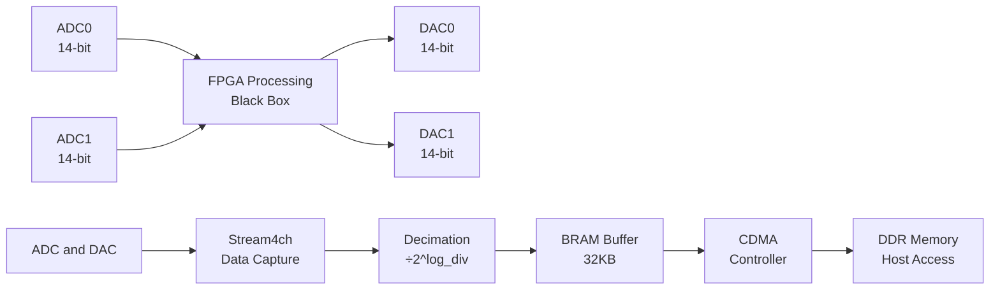

# 4-Channel Streaming Module

**Module:** `stream4ch`  
**Type:** `stream4channel_axi_wrap`  
**Description:** Real-time 4-channel data acquisition with configurable decimation and CDMA transfer.

This module captures data from 4 channels simultaneously and streams it to memory via DMA. It can be used with any FPGA processing pipeline to monitor inputs and outputs in real-time.

---

## 1. Overview

The streaming module provides:
- **4-channel simultaneous capture**: 16-bit samples per channel
- **Configurable decimation**: From 125 MHz down to ~1.9 Hz  
- **Large buffer**: 32 KB BRAM (4096 samples per channel)
- **DMA transfer**: Automatic CDMA transfer to DDR memory
- **Frame-based acquisition**: Configurable frame length (1-4096 samples)

**Data format**: Each 64-bit BRAM word packs 4 channels × 16-bit samples

---

## 2. Signal chain

**Main signal processing:**


**Channel mapping**:
- **Channel 0**: ADC0 input (monitoring input signal)
- **Channel 1**: ADC1 input (monitoring input signal)  
- **Channel 2**: DAC0 output (monitoring processed output)
- **Channel 3**: DAC1 output (monitoring processed output)

---

## 3. Register map

### Base address: `0x40000000`

| Name     | Offset | Bits | Access | Description |
|----------|--------|------|--------|-------------|
| frame_len| 0x00  | [11:0] | R/W   | Number of samples per channel (1-4096) |
| log_div  | 0x04  | [7:0]  | R/W   | Decimation factor: fs = 125MHz / 2^log_div |
| arm      | 0x08  | [0]    | W     | Start capture (write 1 to arm) |
| ack      | 0x0C  | [0]    | W     | Acknowledge frame (write 1 then 0) |
| status   | 0x1C  | [31:0] | R     | Status and monitoring |

### Status register (`0x1C`) format:

| Bits | Name | Description |
|------|------|-------------|
| [31] | sample_tick | New sample available (toggles each sample) |
| [21:11] | wr_idx | Current BRAM write index (0-4095) |
| [10:3] | seq | Frame sequence counter |
| [0] | ready | Frame capture complete (1 when done) |

### Memory map:

| Component | Base Address | Size | Description |
|-----------|--------------|------|-------------|
| Registers | `0x40000000` | 256 bytes | Control/status registers |
| BRAM | `0x41000000` | 32 KB | Data buffer |
| CDMA | `0x7E200000` | - | DMA controller |
| DDR Target | `0x10000000` | - | Host memory destination |

---

## 4. Operation sequence

### 4.1 Configuration
1. Set `frame_len` (number of samples per channel)
2. Set `log_div` (decimation factor)
3. Configure CDMA destination address

### 4.2 Data capture
1. Write `arm = 1` to start capture
2. Monitor `status[0]` (ready bit) or use interrupts
3. When ready=1, write `ack = 1` then `ack = 0`
4. Data is automatically transferred to DDR via CDMA
5. Repeat for continuous acquisition

---

## 5. Python usage

```python
from python_rp.redpitaya_dev import redpitaya_dev

# Connect with any streaming-enabled config
dev = redpitaya_dev("rp", "config/some_stream_config.json")

# Configure streaming parameters
frame_len = 2048
sampling_frequency = 125e6  # Will be decimated

config = dev.setup_cdma(
    frame_len=frame_len, 
    sampling_frequency=sampling_frequency
)

print(f"Actual sampling rate: {config['actual_frequency']/1e6:.3f} MHz")
print(f"Decimation (log_div): {config['log_div']}")
print(f"Frame duration: {config['acquisition_time']*1000:.3f} ms")

# Acquire one frame of data
data = dev.acquire_data()  # Returns (frame_len, 4) array

# Extract individual channels
input_ch0 = data[:, 0]   # ADC0
input_ch1 = data[:, 1]   # ADC1  
output_ch0 = data[:, 2]  # DAC0
output_ch1 = data[:, 3]  # DAC1

# Time axis
t = np.arange(frame_len) / config['actual_frequency']
```

### Real-time streaming examples:
```python
# Overlaid time traces
# python_rp/examples/stream4channel_overlaid.py

# Power spectral density analysis  
# python_rp/examples/stream4channel_psd.py

# Dual-device streaming
# python_rp/examples/stream_2devices_overlaid.py
```

---

## 6. Technical specifications

### Timing:
- **Base clock**: 125 MHz (8 ns period)
- **Decimation range**: log_div = 0-26 (125 MHz to ~1.9 Hz)
- **Frame sizes**: 1-4096 samples per channel
- **Acquisition time**: frame_len / actual_frequency

### Data format:
- **Sample width**: 16-bit signed integers
- **Channel packing**: 4 channels per 64-bit BRAM word
- **Word order**: [Ch3][Ch2][Ch1][Ch0] (LSB = Ch0)
- **Sample range**: -32768 to +32767

### Memory:
- **BRAM size**: 32768 bytes (4096 × 8-byte words)
- **Max samples**: 4096 per channel
- **Addressing**: 12-bit (4096 words)
- **Transfer**: Automatic CDMA to DDR

### Performance:
- **Continuous streaming**: Limited by DDR bandwidth and processing
- **Typical rates**: Up to ~10 MHz sustained acquisition
- **Latency**: <10 µs from trigger to data available

---

## 7. Applications

- **Real-time monitoring**: Input/output signal analysis
- **Closed-loop debugging**: Monitor control system performance
- **Filter characterization**: Input/output comparison for filter design
- **System identification**: Capture stimulus/response data
- **Spectral analysis**: FFT and power spectral density computation
- **Time-domain analysis**: Transient response, settling time measurement