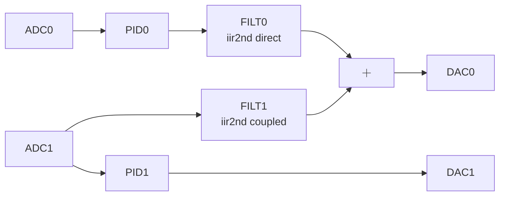

# Z-Control System

**Bitfile:** `bitfiles/z_control.bit`  
**Description:** Combined height (Z) control system implementing PID control with filter conditioning. Suitable for STM/AFM height control applications.  
**Build date:** 2025-11-25

This bitfile provides a complete Z-control feedback system with multiple filter stages for signal conditioning.

**Control scheme:**
- `output0 = pid(input0) + filt(input1)`  
- `output1 = pid(input2)`

**Typical connections:**
- Connect zQPD signal to ADC0, zRF signal to ADC1  
- Connect DAC0 to zFB (height feedback), DAC1 to phase control

---

## 1. Module overview

### Control modules:
- **`pid0`** — PID controller for height control (ADC0 → DAC0)
- **`pid1`** — PID controller for phase control (ADC1 → DAC1)
- **`filt0`** — Direct-form IIR filter for signal conditioning
- **`filt1`** — Coupled-form IIR filter for RF processing

Update period: `8.192e-6 s` (≈122.07 kHz) for all modules.

**Module settings:**
- **PID controllers**: 32-bit data/coeff, Q16 coefficients, Q9 gains
- **Direct filter**: 32-bit data/coeff, Q30 coefficients, Q9 gains  
- **Coupled filter**: 20-bit data/coeff, Q19 coefficients, Q10 gains

---

## 2. Signal chain



---

## 3. Register map

### 3.1 `pid0` (Height Control) — base `0x40001000`

| Name | Offset | Signed | log_scale | Description |
|------|--------|--------|-----------|-------------|
| setpoint | 0x00 | yes | 31 | Target height setpoint |
| Kp | 0x04 | yes | 16 | Proportional gain |
| Ki | 0x08 | yes | 16 | Integral gain |
| Kd | 0x0C | yes | 16 | Derivative gain |
| alpha_d | 0x10 | yes | 31 | Derivative filter coefficient |
| gain | 0x14 | no | 9 | Output scaling |
| ireset | 0x18[1] | no | 0 | Reset integrator |
| reset | 0x18[0] | no | 0 | Reset all states |

### 3.2 `pid1` (Phase Control) — base `0x40002000`

Same structure as `pid0`, different base address.

### 3.3 `filt0` (Direct-form IIR) — base `0x40003000`

| Name | Offset | Signed | log_scale | Description |
|------|--------|--------|-----------|-------------|
| b0 | 0x00 | yes | 30 | Numerator coefficient |
| b1 | 0x04 | yes | 30 | Numerator coefficient |
| b2 | 0x08 | yes | 30 | Numerator coefficient |
| a1 | 0x0C | yes | 30 | Denominator coefficient |
| a2 | 0x10 | yes | 30 | Denominator coefficient |
| gain | 0x14 | no | 9 | Output scaling |
| reset | 0x18 | no | 0 | Reset filter states |

### 3.4 `filt1` (Coupled-form IIR) — base `0x40000000`

| Name | Offset | Signed | log_scale | Description |
|------|--------|--------|-----------|-------------|
| alpha | 0x00 | yes | 19 | Real part of pole |
| beta | 0x04 | yes | 19 | Imaginary part of pole |
| gainI | 0x08 | no | 10 | In-phase gain |
| gainQ | 0x0C | no | 10 | Quadrature gain |
| reset | 0x10 | no | 0 | Reset filter states |

---

## 4. Python usage

```python
from python_rp.redpitaya_dev import redpitaya_dev
from python_rp.compute_coeff import pid_controller, lowpass, coupled_oscillator

dev = redpitaya_dev("rp", "config/z_control.json")

# Control timing
Ts = 8.192e-6  # 122.07 kHz

# Configure height PID
pid_height = pid_controller(
    Kp=1.0, Ki=100.0, Kd=0.01,
    Ts=Ts, setpoint=0.0
)
dev.set_all_registers("pid0", pid_height, reset=True)

# Configure RF filter  
rf_filter = coupled_oscillator(
    frequency=1000, Q=50, Ts=Ts,
    gainI=1.0, gainQ=0.0
)
dev.set_all_registers("filt1", rf_filter, reset=True)

# Configure signal conditioning
signal_filter = lowpass(cutoff=500, Ts=Ts)
dev.set_all_registers("filt0", signal_filter, reset=True)
```

---

## 5. Applications

- **STM height control**: Maintain constant tip-sample distance
- **AFM feedback**: Z-piezo control with phase compensation  
- **Interferometry**: Path length stabilization
- **Active damping**: Vibration isolation systems

---

## 6. Notes

- **Stability**: Ensure PID gains provide stable closed-loop response
- **Reset sequence**: Always reset after coefficient updates  
- **Filter stability**: Coupled-form more stable for high-Q resonators
- **Saturation**: All modules include anti-windup protection
